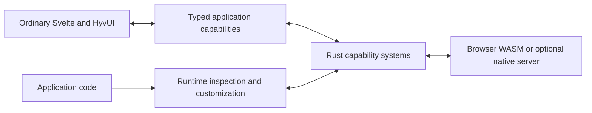

> Historical September 30 / October 1 design. Superseded by [the 0.3 design](../DESIGN.md). Present-tense claims below describe that baseline, not the active desktop release.

# Revenant: a framework that changes how you build apps

Product design established on September 30, 2026. Recon baseline: `ba7c750`.

This document defines the application framework and the criteria for judging it. The September 30 recon is historical evidence. The October 1 implementation direction is web first: ordinary hosted URLs, a browser/WASM core, and an optional native Rust server. [0.2 implementation](IMPLEMENTATION-0.2.md) records the package and boundary contracts. Desktop hosting follows later.

## 1. Product promise

Revenant should become Hendrick's first choice for building applications because it makes the application easier to express, understand, and change. Its first proving ground is a file/media utility served at a normal URL and evaluated on Windows. Rust runs in browser WASM by default; a native Rust server is optional. The UI is ordinary Svelte, and simple application behavior can remain in TypeScript.

The value must appear in the code the developer writes. A good development command saves setup. A good application framework also saves the recurring coordination between native operations, reactive state, progress, failure, configuration, and lifecycle. Revenant must do both.

Reuse proven foundations for execution, serialization, networking and presentation. The distinctive contribution is the application model and its authoring experience. Shipping another starter project with nicer colors would leave most of the work with the developer. Tauri may become a desktop adapter later; its command API is not Revenant's authoring model.

## 2. What exists

The September 30 recon established the following baseline:

| Existing behavior | Evidence and consequence |
| --- | --- |
| `new`, `dev`, `build`, and `setup` coordinate Rust/WASM and SvelteKit | The project is a development CLI. Generated applications use browser WASM and a static SvelteKit adapter. |
| Rust exports produce a contract manifest and TypeScript facade | Automatic glue is worth retaining. `src/bindings.rs` (removed historical source) reads top-level exports from `rust/src/lib.rs`. |
| Synchronous free functions can cross the bridge with simple values | Supported values are primitives, strings, and typed numeric vectors. Internal representations understand richer shapes, but exported structs, enums, tuples, options, and results are rejected by the current runtime bridge. Async exports and exported methods are unavailable. |
| The code is small and separated into commands, tooling, scaffolding, and bindings | There are 2,487 Rust source lines, including embedded templates and unit tests. This is a useful seed with limited application-level behavior. |
| `cargo test --locked` passed during recon on Windows | All 25 unit tests and the scaffold integration test passed. They do not establish live reload, desktop lifecycle, or packaged-app reliability. |

There is no native desktop host, application capability runtime, or general facility for inspecting and replacing running application systems. The `WasmBuilder` trait is an internal build seam; it is not an application extension model.

Several limits affect the reliability story:

- [Development orchestration](../../src/commands/dev.rs) can report a successful WASM rebuild after binding regeneration failed.
- The watcher covers `rust/src/`; the live development loop and process cleanup lack behavioral tests.
- [CI](../../.github/workflows/rust.yml) currently builds and tests Rust on Ubuntu only.
- The live WASM/browser workflow was not verified during recon because `wasm-pack` was unavailable.
- Git tracks 324 generated artifacts under the example's Rust target directory. Repository size therefore exaggerates the amount of authored code.

These are observed limits of the existing product. This document records their implications for future guarantees; it does not turn them into an implementation task list.

### Lessons from the sibling projects

HyvUI contributes an actual Svelte library with a recognizable visual vocabulary, reusable components, and customization surfaces. Its documented copy voice is calm, precise, and oblique. Revenant's bold, vulgar, sarcastic voice is a new direction layered onto that visual foundation.

ezsgame supplies the more important authoring comparison. Its application code composes `Rect`, `Text`, relative positions, object-scoped events, and behaviors such as `Controller` and `DetectNear`. Existing objects and behaviors remain reachable through `World`. The developer works in a useful game vocabulary while pygame handles lower-level machinery.

The lesson is simpler expression and accessible capabilities. Objects help because they collect an API around something meaningful. Revenant can achieve that discoverability through Rust traits, typed values, and coherent app-facing interfaces. It does not require adopting a game object or component architecture.

The sibling checkouts at recon were `C:/T/Projects/hyvui` and `C:/T/Projects/ezsgame`; their APIs and documentation informed this direction without becoming dependencies of the current CLI.

## 3. The four pillars

### Svelte simplicity

Keep normal Svelte components, HTML, CSS, events, and reactivity. A small view should be understandable as Svelte. Existing framework capabilities should support useful small apps without custom native code or a separate application description language.

Native work should appear through typed, discoverable application APIs. The framework owns the repeated coordination needed to make native results and task state usable from Svelte. The developer owns the view and application-specific decisions.

Keep one clear route from creating a project to developing and building it. The existing `revenant new`, `revenant dev`, and `revenant build` commands are the reference happy path. Developers should not need to coordinate separate native and UI processes just to work on an app.

### Hyv personality

Use the actual HyvUI library as the default, replaceable visual layer. Preserve its conviction about presentation while giving Revenant its own sharper voice. Boldness, vulgarity, and sarcasm belong in intentional copy and interaction, rather than repeated novelty messages.

A button can say "pick a damn file." A failed operation must still explain what failed, identify the relevant condition, and provide a useful next action. Machine-readable errors retain stable meaning regardless of presentation. Applications can replace the visual layer and voice without replacing the native core.

### Rust guarantees and restraint

Use Rust to enforce ownership, capability contracts, and compatible composition wherever possible. [Traits](https://doc.rust-lang.org/book/ch10-02-traits.html) can share behavior across types and require implementations to satisfy a common interface. Configuration and runtime changes still require validation at their boundaries.

Code volume is a design responsibility. Keep one authoritative definition of a custom capability's contract and data shapes. Derive the app-facing view of that definition instead of making developers repeat it in Rust, TypeScript, transport handlers, and documentation.

An abstraction earns its place when it removes recurring work or clarifies a boundary. A small application should pay for the capabilities it uses. Avoid arbitrary line-count quotas; measure repeated definitions, hand-written glue, setup steps, and concepts the developer must learn.

### Python-like malleability

Make the framework accessible through the application runtime. Developers should be able to find active systems, inspect their supported state and configuration, and use documented extension and replacement points.

Useful defaults coexist with ordinary application code and custom implementations. New Rust code can require a rebuild. An embedded Python interpreter and arbitrary live code replacement are outside the initial product promise.

## 4. Authoring model and conceptual interfaces

The normal path begins with the thing the developer is already working with: an application, collection, selected value, or operation. Related capabilities should be available there through editor completion and concise documentation. Each API has a clear purpose and a small set of meaningful operations.

| Term | Meaning |
| --- | --- |
| Capability | A coherent set of supported behavior, such as browsing files, running an operation, or remembering settings. |
| Handle | A typed reference through which application code uses a capability or a live resource. |
| System | The implementation backing a capability, with its dependencies, configuration, owned state, and lifecycle. |
| Runtime | The running application's capabilities and systems, including their coordination and supported inspection and customization. |

These terms describe responsibilities. They do not prescribe a hierarchy of base classes or require every application value to be a registered system.



### Native and Svelte interfaces

Rust interfaces express reusable native behavior and its requirements. The Svelte-facing facade preserves capability grouping, supported input and output shapes, errors, and observable operation state. Related methods should remain discoverable together as the application grows into multiple modules.

The authoritative contract must correspond to the native behavior actually available in the build. Unsupported boundaries fail clearly during definition, generation, or startup as appropriate. Types, operations, and runtime metadata must agree. The existing single-file export parser cannot serve as the complete future capability model.

Ordinary application code can use a built-in capability or supply a custom implementation through its supported interface. Direct access to the underlying host remains an explicit escape hatch for work the framework has not generalized.

### Runtime interface

Application code can discover active systems and their supported capabilities, inspect status and configuration, and identify the implementation supplying a capability. Observing supported state should use the same meaningful vocabulary as the app-facing API.

Customization operates through defined interfaces. Internal resource ownership and arbitrary memory mutation are not public controls. One runtime access point can make capabilities convenient to find while scoped ownership keeps unrelated resources and application contexts independent.

Inspection is available programmatically. A developer inspector can present it, but a GUI inspector is not required to exercise runtime access. Inspection must distinguish supported snapshots from configuration or state that can be changed.

## 5. Illustrative authoring recipes

The following sketches communicate the intended experience. `$lib/revenant`, method names, trait signatures, and data types are illustrative and do not establish a package layout or final public API. The simple Svelte markup remains ordinary application code.

### A minimal app

An app uses one built-in capability to pick a file and display its name:

```svelte
<script lang="ts">
  import { Button, Text } from '@hyvnt/hyvui';
  import { useApp } from '@revenant/client/svelte';

  const app = useApp();

  let filename = $state('nothing selected');

  async function pickFile() {
    const file = await app.files.openFile();
    if (file) filename = file.name;
  }
</script>

<Button onclick={pickFile}>pick a damn file</Button>
<Text>{filename}</Text>
```

This app should require no custom Rust implementation, hand-written native command registration, or manually maintained transport types. Cancelling the picker leaves the current choice alone. Native failures use a useful default presentation that the application can replace with local handling; their structured meaning and recovery context remain available.

### The file/media proving ground

The reference utility supports a complete daily workflow:

1. Open a local folder and obtain a collection of its files.
2. Browse and filter the collection with ordinary Svelte UI. Preview supported content; unsupported formats have a clear state.
3. Select items and apply a compatible operation.
4. Observe progress, results, and failures while the UI remains responsive.
5. Request cancellation and observe when it has taken effect.
6. Remember useful view settings across visits. Restore a folder bookmark where the browser supports it and request permission again when required. Directory input fallback cannot remember access to local files.

The central application logic should resemble this intent:

```ts
const library = await app.files.openFolder();
const selection = library.selection();
const task = selection.run(app.media.readMetadata);
const preferences = app.settings.define({ sort: 'name', showHidden: false });
```

The developer supplies browsing, selection, and presentation decisions. The framework supplies the repeated native coordination, observable task behavior, owned resources, and persistence. Svelte can display the task's supported state without an application-specific polling loop or manually wired progress channel.

A task captures its input when it starts. Changing the UI selection afterwards must not silently change the running operation's inputs. A batch makes individual results and partial failures visible.

### A custom Rust capability

A developer adds a metadata operation through a coherent native interface:

```rust
pub struct ReadMetadata;

impl Operation for ReadMetadata {
    type Input = MediaFile;
    type Output = MediaMetadata;

    fn run(&self, file: Self::Input, task: TaskContext) -> Result<Self::Output> {
        task.check_cancelled()?;
        extract_metadata(file)
    }
}
```

The operation, its output shape, and any required capability information have one authoritative Rust definition. Its app-facing contract is derived from that source. Adding it may require a rebuild and a concise registration step, but must not require matching hand-written TypeScript definitions and transport handlers.

The developer writes the metadata extraction. Existing operation support supplies its execution, observation, cancellation protocol, and cleanup behavior. Long-running custom code must cooperate with cancellation by checking its task context at safe points. The runtime must report the actual outcome rather than pretending a cancellation request instantly stops arbitrary native code. A compatible operation can participate in the same collection workflow as a built-in operation.

Rust traits do not automatically provide cross-language generation or runtime discovery. Compiled operation registrations supply the authoritative contracts; TypeScript definitions and runtime validation schemas are generated from them. Typed TypeScript providers can replace compatible behavior in the browser while Rust retains boundary and ownership checks. New Rust implementations require rebuilding.

## 6. Guarantees and customization boundaries

| Concern | Required behavior |
| --- | --- |
| Ownership | Every native resource and running operation has a clear owner. Releasing its scope has defined cleanup behavior; application shutdown accounts for outstanding work. |
| Lifecycle | Handles expose whether their capability is usable. Calls after disposal or failure produce meaningful outcomes rather than using stale resources. |
| Contracts | Incompatible composition is rejected at the earliest applicable boundary. A generated client must not claim support that the native implementation cannot supply. |
| Cancellation | A request is distinguishable from acknowledged cancellation. The operation reports completed work and partial effects; cancelling does not imply universal rollback. |
| Failure | Native failures retain structured meaning and enough context for recovery. A failed stage cannot be reported as overall success. A usable previous state must be identifiable when it is retained. |
| Persistence | Remembered state has observable save and load failure behavior. Defaults let a simple app start; invalid state or failed writes are not silently presented as successful persistence. |

### Replacement

Replacement means selecting a compatible implementation that is available to the running application. Introducing new native code can require rebuilding.

The runtime validates the replacement's contract and required dependencies before changing the active system. Replacement occurs at a safe lifecycle boundary. If active work or incompatible state prevents it, the runtime reports the reason and preserves the current implementation. The application can finish or cancel work before retrying.

A failed replacement attempt releases any resources it acquired and leaves the previous implementation usable. Changing the default or contract in a new framework version must not silently reinterpret existing application configuration; breaking changes require a documented migration path.

State preservation or migration must be an explicit supported behavior. Replacement must not silently reinterpret existing state or redirect an in-flight operation. Handles and runtime inspection must make the active implementation and any unavailable state clear.

These boundaries make customization usable without pretending that every internal detail can safely change while an app is running.

## 7. Evaluation and acceptance

Compare the authoring experience with direct Svelte plus WASM and optional HTTP calls. Use equivalent views, behavior, error cases, and operations. Count developer-authored coordination separately from generated files, reusable framework implementation, and application-specific algorithms.

| Scenario | Acceptance evidence |
| --- | --- |
| Minimal app | One built-in capability produces a useful app without custom native code or duplicated transport definitions. |
| File/media workflow | Folder access, browsing, supported preview, selection, execution, progress, cancellation, and remembered settings form one coherent workflow. |
| Discoverability | A developer can find the next relevant operation through completion on the value or context already in hand, with concise documentation for its outcome. |
| Custom operation | One authoritative Rust contract produces a usable typed Svelte interface and participates in existing operation behavior. |
| Runtime access | Application code can identify active implementations and inspect their supported status and configuration without relying on a GUI inspector. |
| Replacement | A compatible implementation can be selected at a safe boundary. Incompatible contracts, active work, and unsupported state transfer have explicit outcomes. |
| Failure and shutdown | Denied file access, unsupported content, partial failure, requested cancellation, persistence failure, and closing with active work remain understandable and accountable. |
| Development loop | Success refers to the complete usable result, including its client contract. Failed rebuild stages preserve accurate diagnostics and clearly identify any previous usable result. |
| Web delivery | Static output runs from an ordinary hosted URL. Optional native server output runs independently of development servers. Browser files and server files have explicit, distinct ownership. |

Judge each recipe by hand-written glue, repeated contract definitions, setup steps, and concepts required to understand it. Record which work disappeared and which work remains. A reduction achieved by hiding necessary control or making failures harder to diagnose does not satisfy the promise.

Verify the experience on Windows first. The recon test results are evidence about the original CLI, not acceptance evidence for the capability runtime.

## 8. Priorities and established defaults

The first design priority is the developer's normal path through the minimal app, file/media workflow, and custom capability. Those examples should expose whether the proposed abstractions save work and stay discoverable.

Next, define how coherent capability contracts support Svelte access, native guarantees, runtime inspection, and controlled customization. Application lifecycle and failure behavior are part of that experience. Broader capability libraries should follow demonstrated recurring needs.

Additional build-tool options, WASI targets, post-build optimizations, and template variants earn priority when they serve these workflows. They are earlier CLI extension ideas, rather than the organizing purpose of the new product direction.

Established defaults:

- Web applications at normal URLs are the initial audience; Windows is the first evaluation environment. Desktop is a later host.
- A file/media utility is the reference workflow.
- Rust owns capability contracts and critical guarantees; browser WASM is the default execution location. Ordinary Svelte and TypeScript express UI and simple app behavior. A native Rust server is optional and explicitly addressed through `app.server`.
- HyvUI supplies the default, replaceable visual layer. Revenant supplies its own sharper voice.
- Runtime inspection and supported replacement are product requirements, including typed TypeScript hooks/providers. Replacement validates contracts and dependencies, rejects busy providers, and rolls back failed activation.
- Python supplies an ergonomic reference; ezsgame supplies the standard for simpler expression and accessible capabilities.
- Browser adapters own local file access. Optional server adapters own explicitly uploaded files; a server filesystem is never treated as the visitor's filesystem.
- Implement complete workflows before writing tests. Validation is the final development phase, not an excuse to skip failure and lifecycle design.

This document settles product goals and observable behavior. Exact public signatures, contract-generation machinery, wire formats, package layout, host selection, compatibility migrations, and implementation sequencing belong to a separate implementation design informed by these recipes and acceptance criteria.
